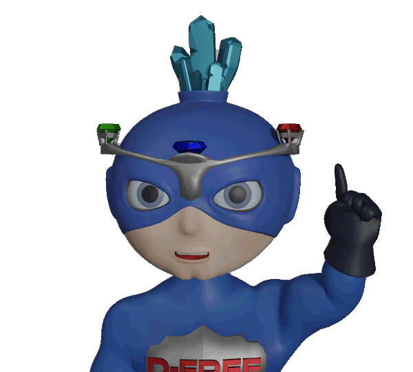
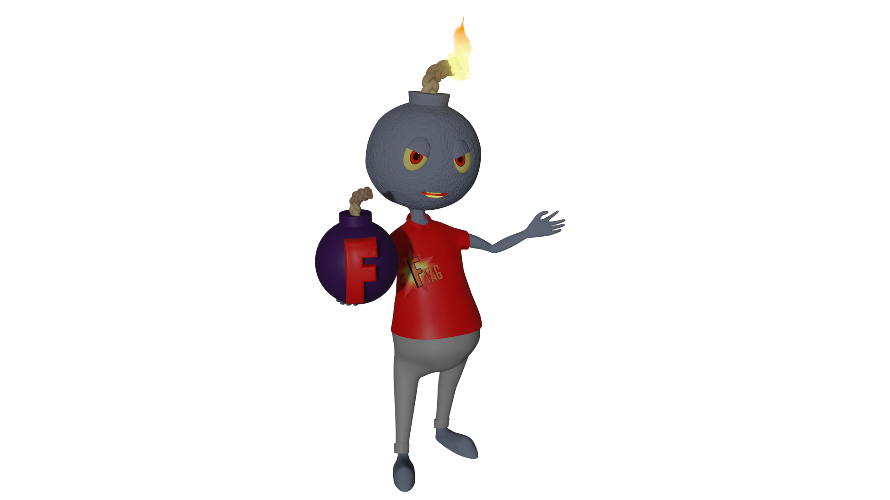

# Mascots

*Open Questions- When should we use the mascot? Should we have multiple mascots? Does it dilute the messaging/impact of the character(s)? Where are they most appropriate? Where does it feel like the use of a character lessens the impact of a message?*

### D-Free

 The name D-Free should always be stylized as D-Free. Always capitalize the D and the F, and always put a dash between them.

D-Free as a character has several emotions and poses. D-Free's emotions should generally reflect the content of the message. He's a superhero whose name means Deficiency-Free. If he's at "full power" and happy, that means there's no deficiencies. If he's sad or unhappy, that means there's problems, and the user should take notice. 

### F-Tag

 The name F-Tag should always be stylized as F-Tag. Always capitalize the F and the T, and always put a dash between them.

F-Tag as a character is a villain. Use F-Tag sparingly, and only in situations that need attention. F-Tag stands for Federal Tag, which is when the Federal Government has taken an interest in a facility in a negative way.
